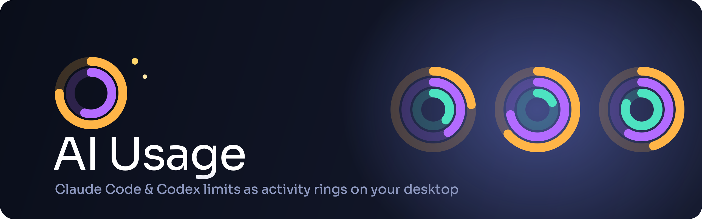
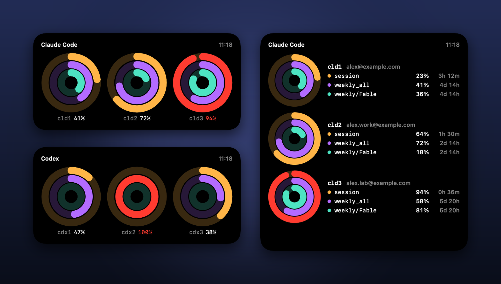
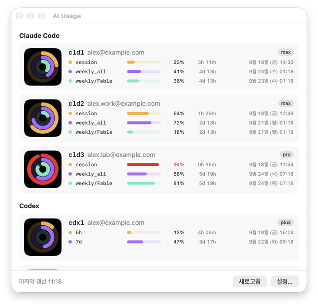

<p align="center">
  
</p>

<p align="center">
  <b>English</b> · <a href="#korean">한국어</a>
</p>

<p align="center">
  
  
  
  
  <a href="https://github.com/TypoStudio/ai-usage/releases/latest"></a>
</p>

# AI Usage

A macOS **desktop widget** that shows the usage limits of several **Claude Code** and **Codex** accounts as activity rings. Glance at your desktop and see which account still has room, without opening a terminal.

<p align="center">
  
</p>

## Features

- 💍 **One gauge per account, three rings per gauge** — outer = 5-hour limit, middle = weekly limit, inner = weekly Fable limit. Codex has 5-hour and 7-day rings.
- 🧩 **Separate Claude Code and Codex widgets** — small (one account), medium (three accounts), and large (three accounts with numbers).
- 🔴 **Alert colors** — a ring turns red past your threshold (default 90%). A dashed gray gauge means the token expired or the request failed.
- 🔎 **Auto-discovery** — finds `~/.claude-*` and `~/.codex-*` config directories. Turn accounts on or off and reorder them in Settings.
- 🔑 **Automatic token refresh** — expired Claude Code tokens are refreshed by running `claude doctor` for you.
- 🔔 **Notifications** — once when a limit crosses the threshold, when Codex workspace credits run out, and when a token refresh fails.
- 🪟 **Detail window** — every account with each limit, its percentage, time left, and the exact reset date and time.
- ⬆️ **Automatic updates** — checks GitHub releases on launch and installs new versions in place.
- 🌐 **Localized** — Korean, English, Japanese.

<p align="center">
  
</p>

## Install

### Homebrew

```bash
brew install --cask typostudio/tap/ai-usage
```

The app is not notarized, so if Gatekeeper blocks the first launch, clear the quarantine attribute once.

```bash
xattr -dr com.apple.quarantine /Applications/AIUsage.app
```

### Download

Grab `AIUsage-x.y.z.dmg` from the [**latest release**](https://github.com/TypoStudio/ai-usage/releases/latest), open it, and drag `AIUsage.app` into **Applications**. On first launch, right-click → **Open**.

### Add the widgets

1. Launch **AI Usage** once. It finds your accounts and starts refreshing every 2 minutes.
2. Right-click the desktop → **Edit Widgets…** → search for **AI Usage**.
3. Add the **Claude Code Usage** and **Codex Usage** widgets in the size you like.

Keep the app running. It launches at login by default. The widget only shows what the app writes, so if the app quits, the widget shows **Open the app**.

## How it works

- The app reads each account's credentials locally and calls the same usage endpoints the CLIs use: `api.anthropic.com/api/oauth/usage` for Claude Code, `chatgpt.com/backend-api/wham/usage` for Codex.
- Claude credentials are read from the Keychain through `/usr/bin/security`, the same way Claude Code stores them, so no extra Keychain prompt appears.
- Results go to a snapshot file in an App Group container. The sandboxed widget only reads that file. **Tokens are never written to the snapshot and never leave your Mac.**
- Codex ring positions are chosen by window length, not by field order, because plans differ (a Team plan reports the 7-day window as primary).

## Build from source

Requires macOS 14+, Xcode 16+, and [XcodeGen](https://github.com/yonaskolb/XcodeGen) (`brew install xcodegen`).
Widget extensions only load when signed by a team, so you need an Apple Development certificate. A free Apple ID works. Ad-hoc signing is not enough.

```bash
INSTALL=1 ./scripts/build-app.sh      # test, build, make a dmg, install to /Applications, launch
```

For development: `AIUSAGE_TEAM=<team id> xcodegen generate && open AIUsage.xcodeproj`.
Core logic tests: `cd Packages/AIUsageCore && swift test`.

## Requirements

- macOS 14 (Sonoma) or later
- Claude Code and/or Codex CLI logged in with one or more config directories (`~/.claude-*`, `~/.codex-*`)

## Project structure

```
AIUsage/                 App: refresh, token refresh, notifications, detail window, settings, updates
AIUsageWidget/           Widget extension: reads the snapshot and draws the rings
Packages/AIUsageCore/    Shared models, response parsers, ring view, tests
Shared/                  String catalog (ko/en/ja) and link images
assets/                  Icon, title, and screenshots
scripts/build-app.sh     Release build → dmg (→ install)
docs/PLAN.md             Design notes (Korean)
```

## Notes

- The usage endpoints are undocumented and may change. Right-click an account and choose **View Response** to see the raw JSON.
- Codex tokens are not refreshed automatically. When one expires, the app shows the command to run once.

## Support

If you like this app, you can support it with a cup of coffee ☕

<a href="https://www.buymeacoffee.com/typ0s2d10" target="_blank"></a>

---

<a id="korean"></a>

<p align="center">
  <a href="#ai-usage">English</a> · <b>한국어</b>
</p>

# AI Usage

여러 **Claude Code**·**Codex** 계정의 사용 한도를 활동 링으로 보여 주는 macOS **바탕화면 위젯**입니다. 터미널을 열지 않고도 어느 계정에 여유가 있는지 바탕화면에서 바로 확인할 수 있습니다.

<p align="center">
  
</p>

## 기능

- 💍 **계정마다 게이지 하나, 게이지마다 링 3개** — 바깥 = 5시간 한도, 가운데 = 주간 한도, 안쪽 = 주간 Fable 한도. Codex는 5시간·7일 링입니다.
- 🧩 **Claude Code·Codex 위젯 따로** — small(계정 1개), medium(계정 3개), large(계정 3개 + 숫자).
- 🔴 **경고 색** — 임계치(기본 90%)를 넘은 링은 빨갛게 바뀝니다. 회색 점선 게이지는 토큰 만료나 요청 실패입니다.
- 🔎 **계정 자동 탐지** — `~/.claude-*`, `~/.codex-*` 설정 디렉토리를 찾습니다. 설정에서 켜고 끄고 순서를 바꿀 수 있습니다.
- 🔑 **토큰 자동 갱신** — 만료된 Claude Code 토큰은 `claude doctor`를 대신 실행해 갱신합니다.
- 🔔 **알림** — 한도가 임계치를 넘을 때, Codex 워크스페이스 크레딧이 떨어질 때, 토큰 갱신이 실패할 때 한 번씩 알립니다.
- 🪟 **상세 창** — 모든 계정의 한도별 퍼센트, 남은 시간, 정확한 리셋 일시.
- ⬆️ **자동 업데이트** — 실행 시 GitHub 릴리즈를 확인하고 새 버전을 그 자리에서 설치합니다.
- 🌐 **다국어** — 한국어·영어·일본어.

<p align="center">
  
</p>

## 설치

### Homebrew

```bash
brew install --cask typostudio/tap/ai-usage
```

공증(notarization)을 받지 않은 앱이라 첫 실행이 Gatekeeper에 막히면 격리 속성을 한 번 제거하세요.

```bash
xattr -dr com.apple.quarantine /Applications/AIUsage.app
```

### 다운로드

[**최신 릴리즈**](https://github.com/TypoStudio/ai-usage/releases/latest)에서 `AIUsage-x.y.z.dmg`를 받아 열고, `AIUsage.app`을 **응용 프로그램** 폴더로 끌어다 놓으세요. 첫 실행 시 우클릭 → **열기**.

### 위젯 추가

1. **AI Usage**를 한 번 실행합니다. 계정을 찾아 2분마다 갱신을 시작합니다.
2. 바탕화면 우클릭 → **위젯 편집…** → **AI Usage** 검색.
3. **Claude Code 사용량**, **Codex 사용량** 위젯을 원하는 크기로 추가합니다.

앱은 계속 켜 두세요. 로그인 시 실행이 기본으로 켜져 있습니다. 위젯은 앱이 쓴 값을 보여 줄 뿐이라, 앱이 꺼지면 위젯에 **앱 실행 필요**가 뜹니다.

## 동작 원리

- 앱이 각 계정의 자격 증명을 로컬에서 읽어 CLI와 같은 사용량 API를 부릅니다. Claude Code는 `api.anthropic.com/api/oauth/usage`, Codex는 `chatgpt.com/backend-api/wham/usage`입니다.
- Claude 자격 증명은 Claude Code가 저장한 그대로 `/usr/bin/security`로 키체인에서 읽으므로 키체인 허용 창이 추가로 뜨지 않습니다.
- 결과는 App Group 컨테이너의 스냅샷 파일에 씁니다. 샌드박스 위젯은 그 파일을 읽기만 합니다. **토큰은 스냅샷에 쓰지 않고 Mac 밖으로 나가지 않습니다.**
- Codex 링 위치는 필드 순서가 아니라 창 길이로 정합니다. 플랜마다 달라서 Team 플랜은 7일 창을 primary로 보냅니다.

## 소스에서 빌드

macOS 14 이상, Xcode 16 이상, [XcodeGen](https://github.com/yonaskolb/XcodeGen)(`brew install xcodegen`)이 필요합니다.
위젯 익스텐션은 팀 서명이 있어야 로드되므로 Apple Development 인증서가 필요합니다. 무료 Apple ID로도 됩니다. ad-hoc 서명으로는 안 됩니다.

```bash
INSTALL=1 ./scripts/build-app.sh      # 테스트, 빌드, dmg 생성, /Applications 설치, 실행
```

개발: `AIUSAGE_TEAM=<팀 ID> xcodegen generate && open AIUsage.xcodeproj`.
코어 로직 테스트: `cd Packages/AIUsageCore && swift test`.

## 요구 사항

- macOS 14 (Sonoma) 이상
- 설정 디렉토리(`~/.claude-*`, `~/.codex-*`)가 하나 이상 로그인된 Claude Code 또는 Codex CLI

## 프로젝트 구조

```
AIUsage/                 앱: 갱신, 토큰 갱신, 알림, 상세 창, 설정, 업데이트
AIUsageWidget/           위젯 익스텐션: 스냅샷을 읽어 링을 그림
Packages/AIUsageCore/    공용 모델, 응답 파서, 링 뷰, 테스트
Shared/                  문자열 카탈로그(ko/en/ja), 링크 이미지
assets/                  아이콘, 타이틀, 스크린샷
scripts/build-app.sh     릴리즈 빌드 → dmg (→ 설치)
docs/PLAN.md             기획서
```

## 참고

- 사용량 API는 공개 문서가 없어 바뀔 수 있습니다. 계정을 우클릭해 **응답 보기**로 원본 JSON을 볼 수 있습니다.
- Codex 토큰은 자동 갱신하지 않습니다. 만료되면 한 번 실행할 명령을 앱이 보여 줍니다.

## 후원

이 앱이 마음에 드신다면 커피 한 잔으로 응원해 주세요 ☕

<a href="https://www.buymeacoffee.com/typ0s2d10" target="_blank"></a>
